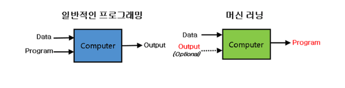
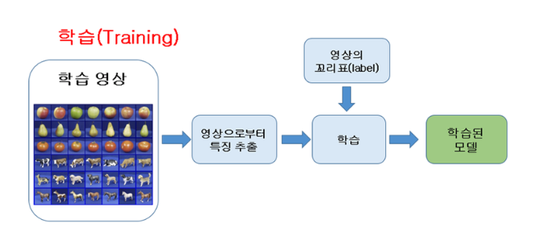
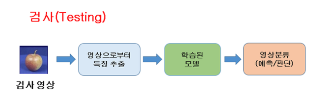
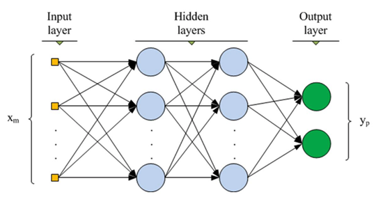

# Auto-Encoder

#### 머신러닝?

일반적인 프로그래밍은 프로그램을 짜고 입력 데이터를 넣어주면, 사전에 기대했던 출력이 나오는 방식이다.
이에 반해 머신러닝은 입력 데이터와 기대값(출력, 학습결과) 을 함께 넣어주고 학습을 통해 프로그램을 만들어 낸다.
단, 자율학습(Unsupervised Learning) 의 경우는 입력 데이터만 넣어주면, 스스로 학습하여 결과를 만들어 낸다. 

###### 머신러닝의 과정

####### 1) 학습; 일반화

####### 2) 검사

###### 용어참고
####### 지도학습 vs 자율학습 vs 강화학습
####### Ensemble; Boosting vs Bagging(Bootstrap AGGregatING) 

#### MLP; Multi-Layer Perceptron 

- Supervised Learning 학습이다.
- 입력값과 기대값, 쌍으로 이루어진 학습 데이터를 이용해 학습을 한다.
- 출력값과 기대값의 차이를 확인하면, 이를 Back-Propagation 방법을 사용하여 각각의 Net(Neural-Net, Perceptron) 에 해당하는 Weight 값을 조금씩 변화시킨다.
- 위 과정을 반복적으로 수행하며, 출력값이 기대값에 수렴하게 되거나 일정 조건/수준에 도달하면 학습을 마친다.

#### 종류

##### 1) Stacked AutoEncoder; SAE
##### 2) Sparse AutoEncoder
##### 3) Denoising AutoEncoder; dAE
##### 4) Stacked Denoising AutoEncoder; SdAE
##### 5) Contractive AutoEncoder; CAE
##### 6) Stacked Convolutional AutoEncoder
##### 7) Generative Stochastic Network; GSN
##### 8) Winner-Take-All AutoEncoder
##### 9) Generative Adversarial Network; GAN
